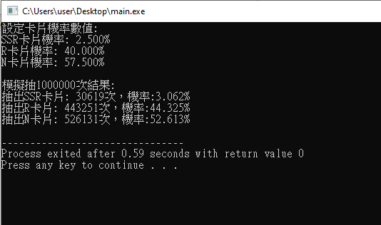

# CardProbabilitySimulator
抽卡模擬器，簡易模擬SSR、R、N三張卡片的抽取。  
設定卡片機率後抽取1000000次。

採動態記憶體配置，若需額外添加/減少卡片僅需修改卡片陣列。

編譯器環境C99。

### 卡片機率
<table>
<tr>
  
<td>卡片</td>  
<td>SSR卡片</td>  
  <td>R卡片</td>  
  <td>N卡片</td>  
</tr>
  <tr>
<td>抽中率</td>  
<td>2.5%</td>  
  <td>40%</td>  
  <td>57.5%</td>  
</tr>
</table>

### 流程圖

### 測試結果

### 參考文獻
+ https://forum.gamer.com.tw/Co.php?bsn=23805&sn=3358275
+ https://forum.gamer.com.tw/Co.php?bsn=23805&sn=3358183
+ https://pttgame.com/chainchron/M.1388918007.A.94F.html
+ https://forum.gamer.com.tw/Co.php?bsn=36833&sn=60151
+ https://gist.github.com/JLChnToZ/83a684201173f651de57d497e4922084
