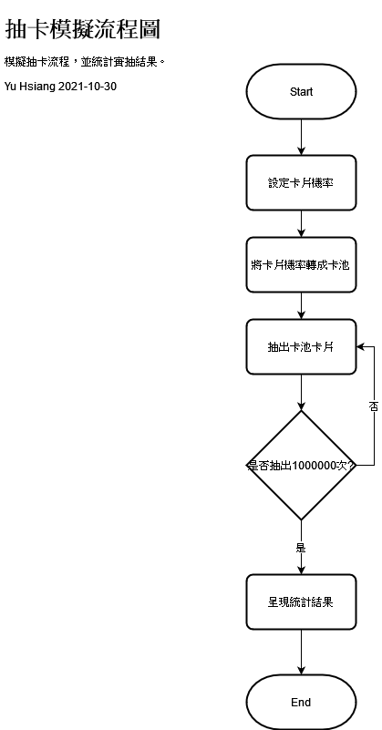

# CardProbabilitySimulator
抽卡模擬器，簡易模擬SSR、R、N三張卡片的抽取。  
設定機率後抽取1000000次

### 卡片機率
<table>
<tr>
  
<td>卡片</td>  
<td>SSR卡片</td>  
  <td>R卡片</td>  
  <td>N卡片</td>  
</tr>
  <tr>
<td>抽中率</td>  
<td>2.5%</td>  
  <td>40%</td>  
  <td>57.5%</td>  
</tr>
</table>

### 流程圖

